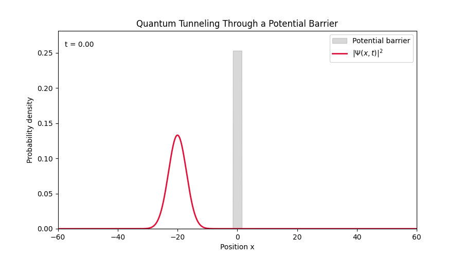
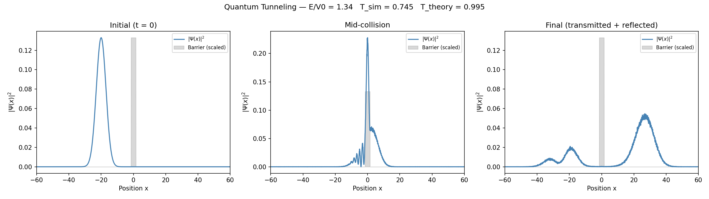
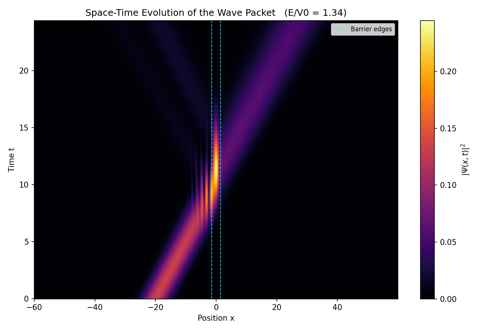
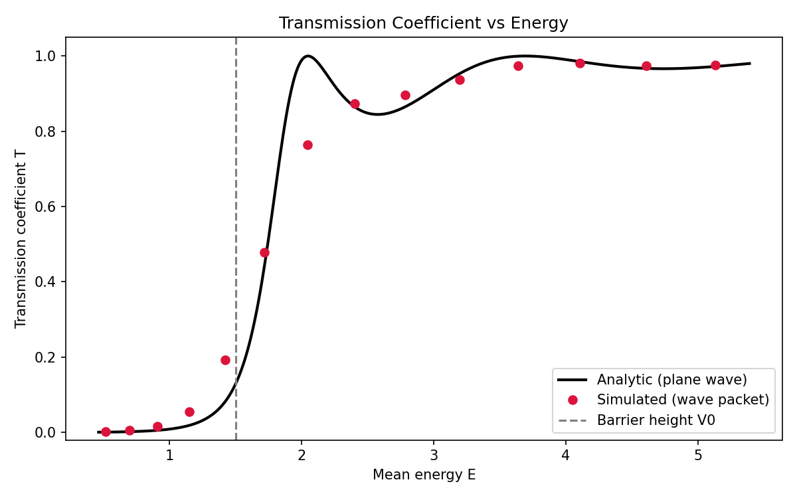
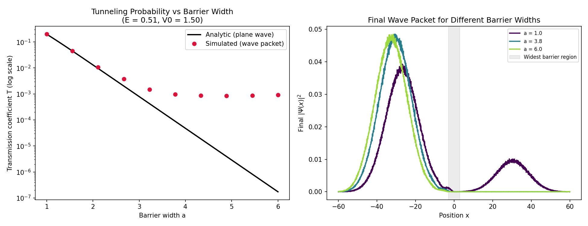

# ⚛️ Quantum Tunneling Simulation

**Numerical solution of the 1D time-dependent Schrödinger equation**,
simulating a Gaussian wave packet tunneling through a rectangular
potential barrier via the split-step Fourier (split-operator) method.

[](LICENSE)
[](https://www.python.org/)

<p align="center">
  
</p>

## 🔭 Overview

A particle's wave function hitting an energy barrier it classically
shouldn't be able to cross and quantum mechanics saying part of it
gets through anyway. This project solves the Schrödinger equation
numerically (no approximations beyond standard discretization) to show
exactly how much of the wave packet tunnels through, reflects back,
and how that compares to the analytic formula.

## ✨ Features

- **⚡	Split-step Fourier solver** — `O(N log N)` per time step,
  unconditionally stable, exactly unitary for a real potential
- **🧱 Absorbing boundaries** (complex absorbing potential) so wave
  packets don't unphysically wrap around the periodic FFT grid
- **📐 Exact analytic benchmark** — every simulated result is checked
  against the closed-form stationary-state transmission coefficient
- **🎨 Five ready-to-run scripts**, each producing one publication-quality
  figure or animation

## 🚀 Installation

```bash
git clone https://github.com/YOUR-USERNAME/quantum-tunneling-simulation.git
cd quantum-tunneling-simulation
pip install -e .
```

This installs the `qtunnel` package (numpy, scipy, and matplotlib are
pulled in automatically). Python 3.9+ required.

## ⚡ Quickstart

```bash
cd simulations
python sim1_snapshots.py
```

Every script in `simulations/` also runs directly from a fresh clone
without the `pip install` step (each has a small `sys.path` bootstrap),
so `python simulations/sim1_snapshots.py` works too.

## 🎬 The five simulations

| Script | Output | Shows |
|---|---|---|
| `sim1_snapshots.py` | `tunneling_snapshots.png` | Before / during / after panels of the collision |
| `sim2_animation.py` | `tunneling_animation.gif` | Live animation of the wave packet crossing the barrier |
| `sim3_spacetime_map.py` | `tunneling_spacetime_map.png` | Position-vs-time heatmap of the entire collision |
| `sim4_transmission_vs_energy.py` | `transmission_vs_energy.png` | Transmission coefficient vs energy, sim vs exact formula |
| `sim5_barrier_width_effect.py` | `barrier_width_effect.png` | Transmission vs barrier width (log scale) |

### 1. 📸 Snapshots
The animation displays the probability density |Ψ(x,t)|² as the wave packet approaches and interacts with the potential barrier.
<p align="center"></p>

### 2. 🗺️ Space-time map
The space-time map represents the evolution of the probability density as a function of both position and time.
It provides a compact view of the entire collision process.
<p align="center"></p>

### 3. 📈 Transmission vs energy
This simulation compares the numerically calculated transmission coefficient with the analytical solution.
<p align="center"></p>

### 4. 📉 Transmission vs barrier width
This investigates how changing the barrier width affects the probability of tunneling.
<p align="center"></p>

Each script has an editable parameter block at the bottom (barrier
height/width, incoming momentum, grid resolution, etc.) — see the
docstring at the top of each file for details.


## 🧠 The physics

The time-dependent Schrödinger equation

$$i\hbar \frac{\partial \Psi}{\partial t} = -\frac{\hbar^2}{2m}\frac{\partial^2 \Psi}{\partial x^2} + V(x)\,\Psi$$

is solved with the split-step Fourier method. The time-evolution operator is split into a potential half-step (applied in position space) and a kinetic full-step (applied in momentum space via FFT):

$$\Psi(x, t+\Delta t) \approx e^{-\frac{i V \Delta t}{2\hbar}}\;\mathcal{F}^{-1}\!\left[e^{-\frac{i \hbar k^2 \Delta t}{2m}}\;\mathcal{F}\!\left[e^{-\frac{i V \Delta t}{2\hbar}}\,\Psi(x, t)\right]\right]$$


## ✅ Validation

Every result here is checked, not assumed:

- Below-barrier (E/V₀ ≈ 0.34): simulated T ≈ 0.002 vs analytic T ≈ 0.0008 — correctly tiny.
- Above-barrier (E/V₀ ≈ 1.34): simulated T ≈ 0.75 vs analytic T ≈ 0.99 — high transmission, gap explained by the wave packet's energy spread.
- The transmission-vs-energy scan (`sim4`) tracks the analytic curve closely, including resonance oscillations above V₀.
- A known limitation — the simulated transmission floors out around 10⁻³ for very opaque barriers due to floating-point precision, not physics — is documented in `docs/theory.md` and in `sim5`'s output.

## 🧪 Running the tests

```bash
pip install -e ".[dev]"
pytest -v
```

## 📄 License

[MIT](LICENSE) — free to use, modify, and share.
